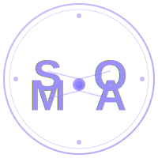

# SOMA Premium Logo System
## Brand Guidelines & Technical Specifications

---

## 🎯 Logo Concept

**Monogram Design**: The letter "S" seamlessly integrated inside a perfect circular "O"

**Design Principles**:
- Ultra-minimalist, geometric construction
- Zero gradients, shadows, or decorative effects
- Perfect symmetry and mathematical balance
- Swiss design aesthetic (Helvetica inspired)
- Instantly recognizable at any scale
- Premium technology positioning

**Inspired by**: Apple, OpenAI, Stripe, Notion, Linear, Anthropic

---

## 📋 Logo Versions

### 1. **Icon Version** (Primary)
- **File**: `soma-premium-logo-final.svg`
- **Usage**: App icons, favicons, social media, small applications
- **Dimensions**: Square (1:1 aspect ratio)
- **Optimal Sizing**: 32px—512px

### 2. **Horizontal Logo** (Lockup)
- **File**: `soma-premium-horizontal.svg`
- **Usage**: Website headers, email signatures, business cards
- **Dimensions**: 5:1 aspect ratio (approximately)
- **Optimal Sizing**: 200px—800px wide

### 3. **Vertical Logo** (Stacked)
- **File**: `soma-premium-vertical.svg`
- **Usage**: Vertical spaces, mobile layouts, posters
- **Dimensions**: 1:1.5 aspect ratio (approximately)
- **Optimal Sizing**: 150px—600px

### 4. **App Icon Version**
- **File**: `soma-premium-app-icon.svg`
- **Usage**: iOS, Android, Web app stores
- **Dimensions**: Square (1:1) with safe margins
- **Recommended Sizes**:
  - iOS: 180×180px (3x), 120×120px (2x), 60×60px (1x)
  - Android: 192×192px (xxhdpi), 144×144px (xhdpi), 96×96px (hdpi), 72×72px (mdpi)
  - Web: 192×192px, 512×512px

### 5. **Background Variations**
- **File**: `soma-premium-variations.svg`
- **Versions**:
  - White background (standard)
  - Black background (dark mode)
  - Monochrome gray (accessible)
  - Solid bold (emphasis)

---

## 🎨 Color Palette

### Primary Colors
| Name | Hex | RGB | Use Case |
|------|-----|-----|----------|
| **Black** | `#000000` | 0, 0, 0 | Primary, digital, web |
| **White** | `#FFFFFF` | 255, 255, 255 | Backgrounds, negative space |

### Secondary Colors (Optional)
| Name | Hex | RGB | Use Case |
|------|-----|-----|----------|
| **Deep Midnight Blue** | `#0F172A` | 15, 23, 42 | Dark mode variant |
| **Electric Blue** | `#3B82F6` | 59, 130, 246 | Accent, interactive elements |
| **Silver Titanium** | `#C0C7D1` | 192, 199, 209 | Borders, subtle background |

### Color Usage Rules
✓ **Always use Black on White** for primary applications  
✓ **Always use White on Black** for dark mode  
✓ **Never use gradients**  
✓ **Never use drop shadows or glows**  
✓ **Never add color effects**  
✓ **Monochrome version uses Gray (#A0AEC0)**  

---

## 📐 Technical Specifications

### Stroke Width
- **Primary (Icon)**: 8.5 units (for 200×200 viewBox)
- **Scaled proportionally** based on final size
- **Minimum stroke width**: 1px at 32px size
- **Maximum visibility**: Maintain at any scale

### Geometry
**The Perfect Circle (O)**:
- Radius: 82 units (in 200×200 viewBox)
- Center: (100, 100)
- Stroke: Centered (no fill)
- Perfect mathematical balance

**The S Curve**:
- **Upper arc**: Right-side curve, naturally flows into circle
- **Lower arc**: Left-side curve, mirrors upper arc
- **Perfect symmetry**: Balanced proportions
- **No serifs or embellishments**

### Line Details
- **Stroke Linecap**: Round (smooth, premium feel)
- **Stroke Linejoin**: Round (seamless curves)
- **Path simplification**: Minimal path data
- **Anti-aliasing friendly**: Clean at any size

---

## 📏 Sizing Guidelines

### Minimum Sizes
| Application | Minimum Size | Notes |
|-------------|-------------|-------|
| Favicon | 32×32px | Web browser tab |
| App icon (small) | 64×64px | Device home screen (minimum) |
| Social media | 100×100px | Twitter, LinkedIn profile |
| Email signature | 60×60px | Alongside name/contact |
| Website header | 80×80px | Navigation bar |
| App store icon | 192×192px+ | iOS/Android listing |

### Maximum Sizes
| Application | Maximum Size | Notes |
|-------------|-------------|-------|
| Website header | 200px | Large desktop layouts |
| Billboard / Large print | Unlimited | Vector scaling |
| Business card | 80×80px | Standard business card |
| Merchandise | Unlimited | T-shirts, hoodies, etc. |

### Responsive Scaling
```
Mobile (320px width):     Icon 40-60px
Tablet (768px width):     Icon 80-100px
Desktop (1920px width):   Icon 120-160px
Large print (poster):     Icon 400px+
```

---

## 🔤 Typography

### When Using Horizontal/Vertical Lockup

**Typeface**: Helvetica Neue, or geometric sans-serif alternative
**Options**:
- Helvetica Neue Bold (600 weight)
- Inter Bold (600 weight)
- Montserrat Bold (600 weight)
- SF Pro Display Bold (Apple ecosystem)

**Letter Spacing**: -0.5px (tight, premium)
**Font Size**: Scale proportionally with icon
**Weight**: 600 (semibold) or 700 (bold)

### Typography Rules
✓ **Sans-serif only** (modern, clean)
✓ **Geometric construction** (like logo)
✓ **Tight letter spacing** (premium feel)
✓ **No lowercase** (SOMA, not Soma)
✓ **Consistent weight** (no mixing weights)

---

## 🎯 Usage Rules

### ✅ DO
- Use the provided SVG files
- Scale proportionally (maintain 1:1 aspect ratio)
- Use pure black or white
- Apply to simple backgrounds
- Use at recommended minimum sizes
- Export as PNG/SVG for web/print
- Maintain clear space around logo

### ❌ DON'T
- Add gradients or transparency
- Apply drop shadows or glows
- Rotate or skew the logo
- Change stroke weights
- Use secondary colors without approval
- Simplify or remove details
- Place on patterned backgrounds
- Use at sizes smaller than 32px

---

## 📦 File Formats

### Primary (Vector)
- **SVG** (Scalable Vector Graphics)
- **Format**: 2D vector, infinite scaling
- **Use**: Web, digital, screen applications
- **Advantages**: Tiny file size, perfect quality at any size

### Secondary (Raster)
Export from SVG to PNG/JPG as needed:
- **PNG** (transparency support)
  - 192×192px (hi-res icon)
  - 512×512px (app store)
- **JPG** (solid backgrounds only)
  - 200×200px (web use)
- **PDF** (print, scaling)
  - Vector format, universal compatibility

### Export Settings (PNG)
```
Format: PNG-32 (RGBA)
Interlacing: Interlaced (Adam7)
Transparency: Yes
Compression: 9 (maximum)
Resolution: 72 DPI (screen)
Resolution: 300 DPI (print)
```

---

## 🏢 Brand Applications

### Digital
- ✓ Website favicon (32×32, 64×64)
- ✓ App icon (platform-specific sizes)
- ✓ Social media profiles (180×180)
- ✓ Email signature (60×60)
- ✓ Slack/Discord profile
- ✓ GitHub profile picture

### Print
- ✓ Business cards (80×80 max)
- ✓ Letterhead (80×80 top-right)
- ✓ Envelopes
- ✓ Notepads
- ✓ Brochures
- ✓ Posters (any size)

### Marketing
- ✓ LinkedIn company page
- ✓ Twitter header
- ✓ Instagram profile
- ✓ Medium publication
- ✓ YouTube channel art
- ✓ Landing page hero

### Physical
- ✓ T-shirts, hoodies
- ✓ Hats, caps
- ✓ Mugs, merchandise
- ✓ Stickers, decals
- ✓ Signage, storefront
- ✓ Vehicle wraps

---

## 🎬 Animation Guidance

The SOMA logo should **not be animated** in standard applications, as it's a timeless, static symbol. However:

### Restricted Animations
- ✓ **Fade in/out** on page load (subtle)
- ✓ **Subtle scale** on hover (0.95—1.05x)
- ✓ **No rotation** (breaks symmetry concept)
- ✓ **No morphing** (compromises identity)
- ✓ **No color transitions** (stays black/white)

### Recommended: Keep Static
The logo works best as a **completely static, unchanging element** that conveys stability, trust, and timelessness.

---

## 📋 Quality Checklist

Before deploying, verify:

- ✓ Logo is perfectly square (1:1 aspect ratio)
- ✓ Stroke widths are consistent
- ✓ Curves are smooth and anti-aliased
- ✓ Works at 32px minimum size
- ✓ Works at 512px maximum size
- ✓ Black on white background is crisp
- ✓ White on black background is crisp
- ✓ No pixelation or distortion
- ✓ SVG file is optimized
- ✓ Safe margins maintained in app icon
- ✓ Typography pairs well with icon
- ✓ Lockup looks balanced and professional
- ✓ Monochrome version is readable
- ✓ All variations are consistent

---

## 🔐 Logo Protection

### Never
- ❌ Use modified versions without approval
- ❌ Change colors or add effects
- ❌ Rotate, skew, or distort
- ❌ Combine with other logos
- ❌ Use with poor contrast on backgrounds
- ❌ Simplify or remove elements

### Trademark
- © SOMA (All rights reserved)
- ™ SOMA (Trademark pending)
- Register trademark in relevant markets
- Protect logo usage rights

---

## 📞 Implementation Support

### Web Implementation
```html
<!-- Favicon -->
<link rel="icon" href="soma-logo.svg" type="image/svg+xml">

<!-- App icon -->
<link rel="apple-touch-icon" href="soma-app-icon-180.png">

<!-- Header -->

```

### CSS Styling
```css
.logo {
  width: 80px;
  height: 80px;
  filter: none; /* No effects */
  transition: opacity 0.3s ease; /* Fade only */
}

.logo:hover {
  opacity: 0.8;
}
```

### Print Specifications
- **Format**: PDF vector file
- **Color Space**: CMYK (convert from RGB for print)
- **Resolution**: 300+ DPI
- **Bleed**: None required (pure logo)
- **Registration**: Standard

---

## 🌍 International Considerations

### Language-Independent
✓ The logo has **no text** (except lockup versions)  
✓ Works in **any language** context  
✓ Culturally **neutral and universal**  
✓ Readable in **all markets**  

### Accessibility
✓ **High contrast** (black on white, white on black)  
✓ **Clear shape** (not reliant on color)  
✓ **Large minimum size** (32px readable)  
✓ **Monochrome version** available for accessibility

---

## ✨ Brand Positioning

**SOMA Logo represents**:
- 🧠 Intelligence, AI, consciousness
- 💜 Trust, reliability, premium quality
- 🔗 Connection, integration, wholeness
- ✨ Elegance, minimalism, timelessness
- 🚀 Innovation, technology, future-forward
- 🎯 Precision, perfection, excellence

**Comparable brands**:
- Apple (minimalist icon)
- OpenAI (geometric symbol)
- Stripe (refined elegance)
- Notion (clean identity)
- Linear (premium tech)

---

## 📄 Files Provided

```
soma-premium-logo-final.svg          (Main icon - Recommended)
soma-premium-icon-v1.svg             (Alternative version)
soma-premium-icon.svg                (Alternative version)
soma-premium-horizontal.svg          (Horizontal lockup with text)
soma-premium-vertical.svg            (Vertical lockup with text)
soma-premium-app-icon.svg            (App store optimized)
soma-premium-variations.svg          (4 background variations)
SOMA-PREMIUM-LOGO-GUIDELINES.md      (This document)
```

---

## 🎨 Next Steps

1. **Choose primary version** from the icon variations
2. **Export to PNG** at required sizes (192×192, 512×512)
3. **Test in applications** (web, mobile, print)
4. **Verify quality** at minimum sizes (32px)
5. **Register trademark** in applicable markets
6. **Create brand guidelines** for team/agencies
7. **Archive official files** in secure location
8. **Update brand assets** across all platforms

---

## 📞 Support & Customization

For modifications or custom sizes:
- All files are provided in **SVG format** (infinitely scalable)
- Can be easily **imported into design tools** (Figma, Illustrator, Sketch)
- All **open vector paths** (editable in any vector editor)
- **No locked or compressed** file restrictions

---

**SOMA Premium Logo System**  
*Designed for timeless, iconic brand recognition*  
*World-class quality, Swiss design excellence*  

✨ **Ready for deployment across all platforms** ✨
